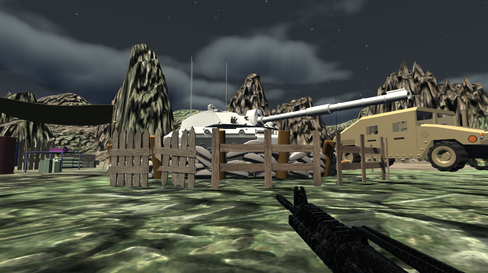

**First Person Shooter Game**

*Description* 

For my first-person shooter game assignment, I wanted to recreate a simple army base scene where the player can immerse themselves what it's like to be in an actual army based. I decided to enhance this army base experience by adding various elements such as a tank, boxes, fences, barrels, and an army rover vehicle. 

As for the player movement, it can be controlled by WASD as well as arrow keys. The FPC can also jump, accompanied by walking sound effects to enhance the gaming experience. Lastly, the player can also shoot by clicking on the mouse's left button. 

*Terrain Design*
I wanted to further immerse the player in an army base environment, so I decided to add mud and some grass textures to the terrain. 

